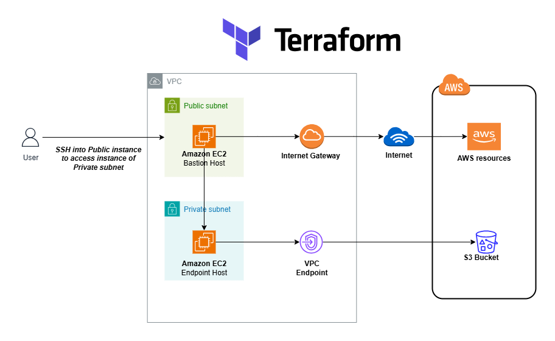

# Terraform AWS VPC S3 Endpoint

This Terraform project provisions a basic infrastructure on AWS, including an EC2 instance inside a private VPC with access to Amazon S3 through a **Gateway VPC Endpoint** — avoiding the need for NAT or Internet Gateway.

---

## 📷 Architecture



---

## 📁 Project Structure

```text
.
├── README.md                         # This file
├── architecture/
│   └── terraform_aws_s3_vpc_endpoint.drawio.png  # Architecture diagram
├── data.tf                           # AWS data sources (e.g., services, availability zones)
├── ec2.tf                            # EC2 instance and related configuration
├── iamRoles.tf                       # IAM roles required for resources
├── keypair.tf                        # SSH key pair creation or reference
├── modules/
│   └── vpc_endpoint_s3               # Module that manages the S3 VPC Endpoint
├── outputs.tf                        # Terraform output definitions
├── providers.tf                      # Provider configuration (AWS)
├── secgroups.tf                      # Security groups
├── terraform.tfvars                  # Variable values
├── variables.tf                      # Variable definitions
└── vpc.tf                            # VPC, subnets, and routing configuration
```

---

## 🌐 AWS Services Used

- **Amazon VPC**: Isolated network environment to host your resources.
- **Amazon EC2**: Compute instance deployed in a private subnet.
- **Amazon S3**: Object storage service accessed from the VPC.
- **VPC Gateway Endpoint**: Enables private access to S3 from the VPC.
- **IAM**: Identity and Access Management roles to securely interact with AWS services.

---

## 🧩 Module: `vpc_endpoint_s3`

Located in `modules/vpc_endpoint_s3`, this module encapsulates logic to provision a **Gateway VPC Endpoint** for the S3 service.

### Expected Variables

- `vpc_id` – The ID of the VPC where the endpoint will be created.
- `route_table_ids` – List of route table IDs to associate with the endpoint.
- `tags` – Optional tags to apply to the endpoint.

### Outputs

- `endpoint_id` – The ID of the created VPC endpoint.
- `dns_entries` – DNS entries (typically not used for Gateway type).

---


## ▶️ Full Deployment & Test Workflow

Follow these steps to deploy the infrastructure and verify access to Amazon S3 via the VPC Endpoint:

### 1. **Deploy with Terraform**

```bash
terraform init
terraform plan
terraform apply
```

### 2. **Access the Endpoint Host via Bastion Host**

```bash
ssh -i bastion_private_key.pem ec2-user@<bastion-host-public-ip>
```

### 3. **SSH into the endpoint host (in the private subnet)**

```bash
ssh -i bastion_private_key.pem ec2-user@<endpoint-host-private-ip>
```

### 4. **Configure AWS CLI on the Endpoint Host**

```bash
aws configure
```

### 5. **Test S3 Access via VPC Endpoint**

```bash
aws s3 ls
```

---

## 📌 Requirements

- Terraform ≥ 1.0
- AWS CLI configured or environment variables with credentials
- SSH key for accessing the EC2 instance (if needed)

---

## 🔐 Security

⚠️ This project creates real AWS resources. Use a test or development environment before deploying in production.

---


